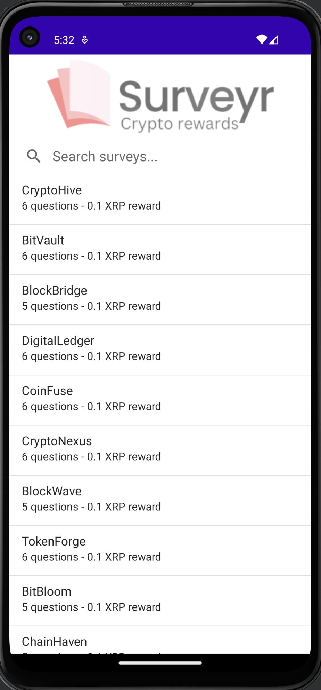

    

# Surveyr

Surveyr is a mobile app that allows companies to obtain direct feedback from users on new product
launches through custom surveys. Users who complete the surveys are rewarded with Ripple
micro-rewards, creating a mutually beneficial relationship between the user and the company. The app
features an intuitive interface that makes it easy for users to participate in surveys and receive
their rewards. With Surveyr, companies can obtain valuable feedback from their target audience
quickly and efficiently while incentivizing users to provide their input.

Built for the XRPL Unlocking the Potential of XRP Ledger Hackathon.

Demo video: https://youtu.be/wu_765ZOo1o

Note this app would require additional work to be production/mainnet ready.

### Inspiration:

With an ever-growing number of new offerings, it can be difficult for companies to
obtain direct feedback from their customers on new product.

ex: https://www.huffpost.com/entry/12-ways-to-get-brutally-h_b_9741656

Often companies have to rely on third-party market research firms to conduct surveys on their
behalf. However, these surveys are often conducted on a small sample size and do not provide
companies with the direct feedback they need to improve their products and services. Additionally,
these surveys are often conducted on a large scale, which can be costly for companies.

The inspiration behind Surveyr was the growing need for companies to obtain direct feedback from
their customers on new product launches. This feedback is essential for
businesses to improve their products and services and stay competitive in their markets. However, we
also saw an opportunity to reward users for their valuable time and feedback by using cryptocurrency
micro-rewards. We chose to use the Ripple blockchain for Surveyr because of its fast confirmation
times, low fees, and high throughput, which enables micro-rewards for providing feedback without
making it cost-prohibitive.

### What it does:

Surveyr is a mobile app that allows companies to obtain direct feedback from users on new product
launches through custom surveys. Users who complete the surveys are rewarded with Ripple
micro-rewards, creating a mutually beneficial relationship between the user and the company. The app
features an intuitive interface that makes it easy for users to participate in surveys and receive
their rewards. With Surveyr, companies can obtain valuable feedback from their target audience
quickly and efficiently while incentivizing users to provide their input.

### Challenges we ran into:

During the development of Surveyr, the team faced several challenges, including integrating the
Ripple blockchain with the app, designing an intuitive user interface, and ensuring the security of
user data. Additionally, we had to work on creating a system that could validate the authenticity of
survey responses while preventing fraudulent activities.

### Accomplishments that we're proud of:

Despite the challenges faced, the Surveyr team successfully built a functioning android app that
enables companies to get direct feedback from their customers while incentivizing users with
cryptocurrency rewards. We are proud of our ability to integrate the Ripple blockchain and xrpl4j
library to facilitate secure and efficient micro-rewards payments.

### What we learned:

From the development process, we gained valuable experience in integrating blockchain technology
into mobile applications, creating user-friendly interfaces, and developing systems to prevent
fraudulent activities. We also learned about the importance of user data privacy and security and
worked to ensure that user data was protected at all times.

### Potential future work / expansion

1. Additional cryptocurrencies integration: More options for micro-rewards.
2. Enhanced user experience: Social sharing, referral programs, user profiles.
3. Smart contract integration: Complex reward structures, automated processes.
4. Improved security measures: Additional encryption and authentication methods, advanced fraud
   prevention.
5. Expansion to other platforms: iOS and web browser versions which could appeal to a wider
   audience.
6. NFT rewards for completing surveys.

### Example address

rQheBm9b6m8YXvEWBqZg58S7fAtcU8efcP

### Screenshots

#### Home Screen

 

#### Filtering results

 

#### Survey Screen

 

#### Survey Complete Screen

 

#### Rewards Screen

 

#### Successful payment

 

#### Setting reward address

 

#### Transaction history (shows rewards after a completed survey)

 

